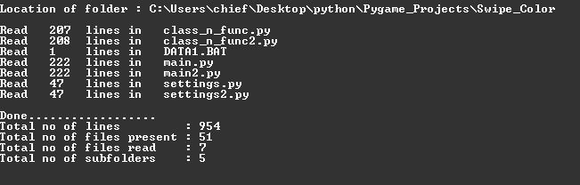

# Read number of lines in files

This programme will count the number of lines not in just one file, but all files and even files present in subfolders.

# How to use?

Just input the location of folder , and its done.  
Example of a location - C:/Users/chief/Desktop/python/Web_Application

# Requirements

Python (recommanded version 3.6)

# Result

this is the end result -  

You also get to see the no of lines read-

